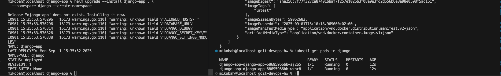
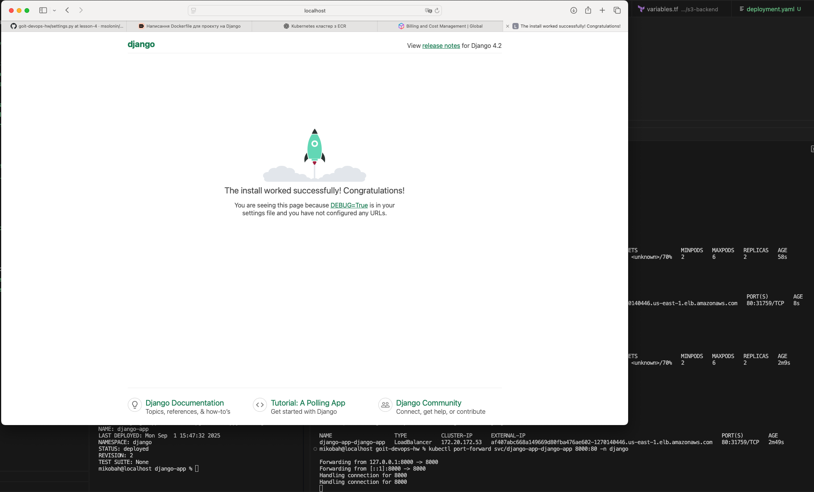

# Як використовувати даний terraform код:

### 1. Виконаемо наступні команди для створення всіх ресурсів котрі нам потрібні

```bash
terraform init
terraform plan
terraform apply
```

Буде створено кластер а також всі необхідні ресурси як база даних в авс та Docker registry

### 2. Після цього треба запушити в створений Docker registry образ Django app з лекції 4:

```bash
docker build -t django-app:latest .
docker tag django-app:latest 020236748758.dkr.ecr.us-east-1.amazonaws.com/ecr-repo-18062025214500:latest
docker push 020236748758.dkr.ecr.us-east-1.amazonaws.com/ecr-repo-18062025214500:latest

```

### 3. Інсталюемо Django app за допомогою Helm Chart:

```bash
cd charts/django-app

helm upgrade --install django-app . \
  --namespace django --create-namespace
```



Щоб подивиться Load Balancer URL:

```bash
kubectl get svc -n django
```

Щоб пперенаправити порт на localhost:

```bash
kubectl port-forward svc/django-app 8000:8000 -n django
```


