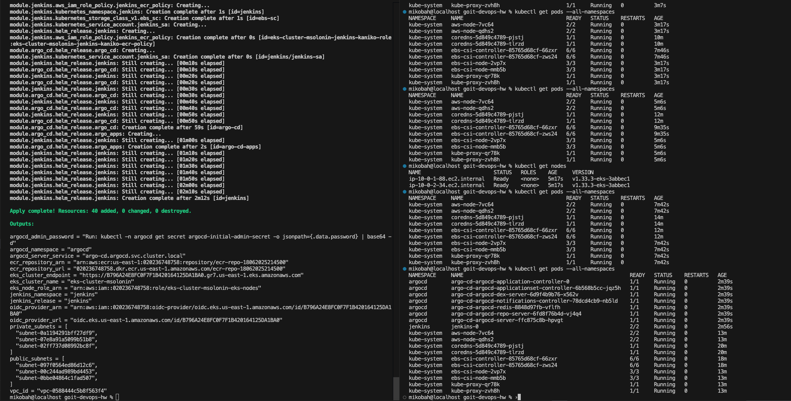
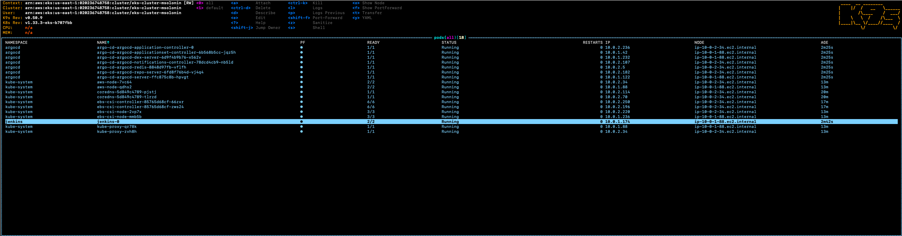
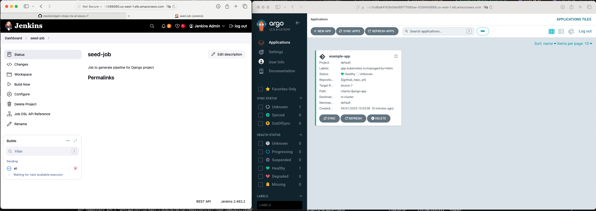

# Як використовувати даний terraform код:

### 1. Спочатку треба зробити наступні кроки:

а) Знайти в репозиторії всі дописи msolonin та замінити на свої

б) Знайти в репозиторії всі назви бранчів lesson-7 та замінити на свої

в) Також можна змінити регіон але треба бути обережнішим з availability_zones вони повинні бути з того ж регіону

### 2. Виконаемо наступні команди для створення всіх ресурсів котрі нам потрібні

```bash
terraform init
terraform plan
terraform apply
```



### 3. Виконаемо наступні команди після створення всіх ресурсів



### а) З правильною назвою кластера та регіона(всі створені ресурси у всіх namespace):

```bash
aws eks update-kubeconfig --name eks-cluster-msolonin --region us-east-1
```

### б) Подивиться на jenkins та argocd (там також можна буде взяти адреси ресурсів):

```bash
kubectl get svc -n argocd
kubectl get svc -n jenkins
```

### в) Креди до ресурсів:

Jenkins:
admin
admin123

Argocd:
admin

```bash
kubectl -n argocd get secret argocd-initial-admin-secret \
  -o jsonpath="{.data.password}" | base64 -d
echo
```


