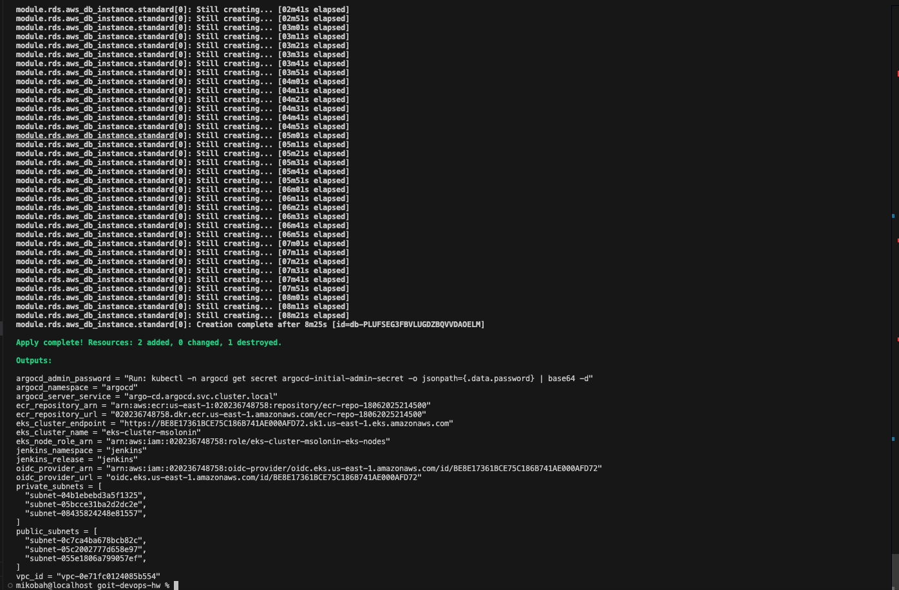
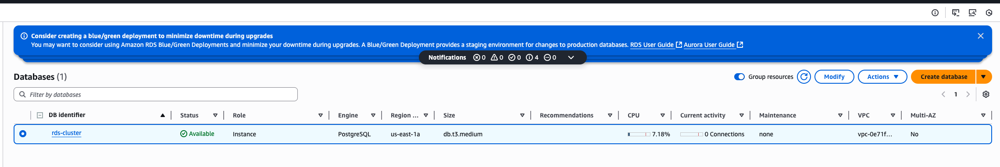

# Як використовувати даний terraform код:

### 1. Піднімаемо всі ресурси такі як eks, vpc, ecr, argo_cd, jenkins, rds

```bash
terraform init
terraform plan
terraform apply
```

Всі ресурси піднято включно з RDS



Змінюючи bool use_aurora true/false: в залежності від цього показника буде підняти aurora/postgressql



### 2. Знищуемо всі ресурси:

In root folder:

```bash
terraform destroy
```
