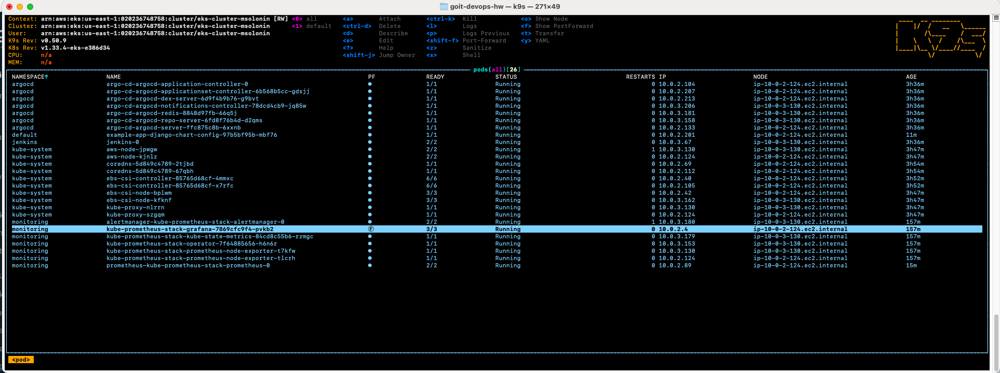
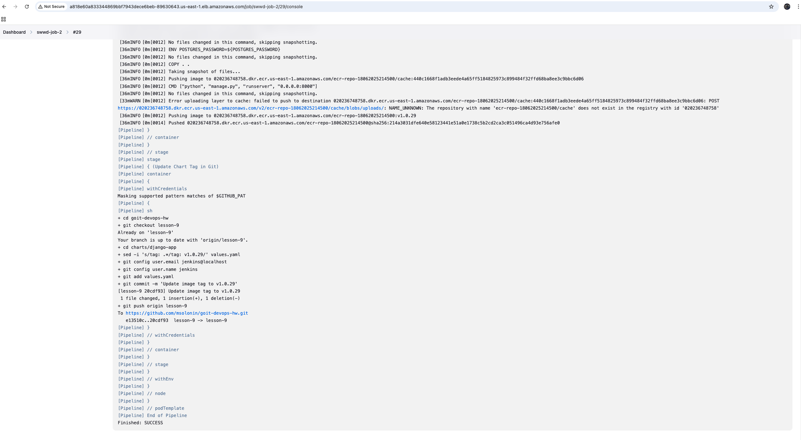
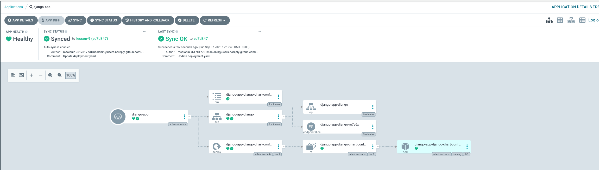
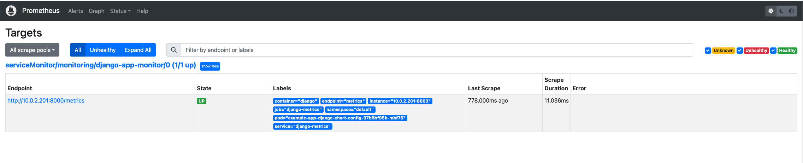
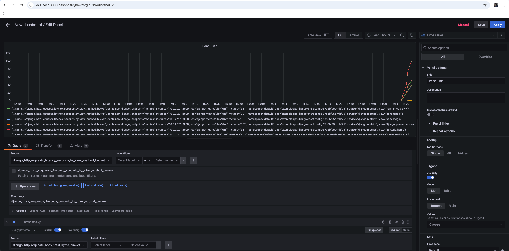

# Фінальний проект

### Технічні вимоги:

Інфраструктура: AWS з використанням Terraform
Компоненти: VPC, EKS, RDS, ECR, Jenkins, Argo CD, Prometheus, Grafana

### 1. Піднімаемо всі ресурси такі як eks, vpc, ecr, rds argo_cd, jenkins, Django app, Prometheus, Grafana (Через Load Balancer буде доступний argo_cd, jenkins, Django app)

```bash
terraform init
terraform plan
terraform apply
```



### 2. Заходимо на дженкінс виконуемо джобу або створюемо нову з використанням свог JenkinsFile

Login/pass:
admin
admin123

```bash
 kubectl get svc -n jenkins
```



Після запуску джоби на ноді береться код з папки django для створення нового контейнеру, контейнер пушиться в ecr, після цього в локальному репозиторії змінюеться тег та пушиться в репозиторій

Використовуемо output з РДС для налаштування бази

### 3. Заходимо в argocd якщо дефолтний апп не працюе:

Login:
admin

```bash
 kubectl get svc -n argocd

kubectl -n argocd get secret argocd-initial-admin-secret \
  -o jsonpath="{.data.password}" | base64 -d
echo
```

для створення нового апп django-app, котрий буде чекаться з цього ж репозиторію



### 4. Робимо налаштування (service-metrics та service-monitor):

```bash
kubectl apply -f manifest/
echo
```

Перевіряемо що логи з Джанго йдуть в прометеус в статусі UP:



Налаштовуемо Графану щоб бачити метрики з Django app:


### 5. Знищуемо всі ресурси:

In root folder:

```bash
terraform destroy
```
